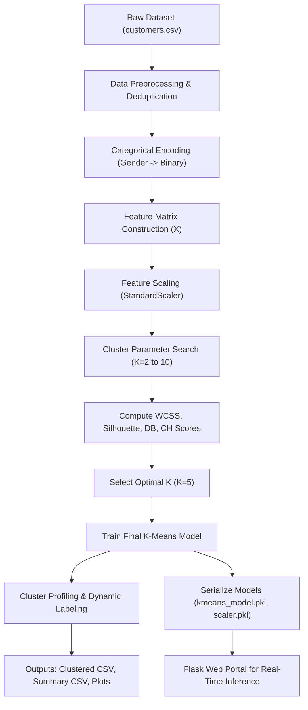
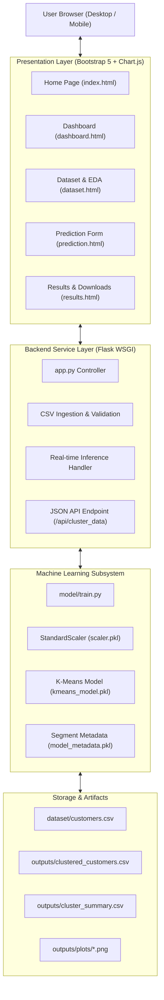
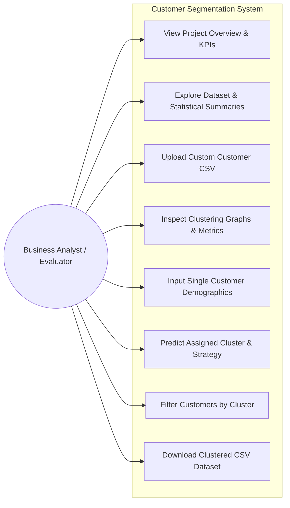
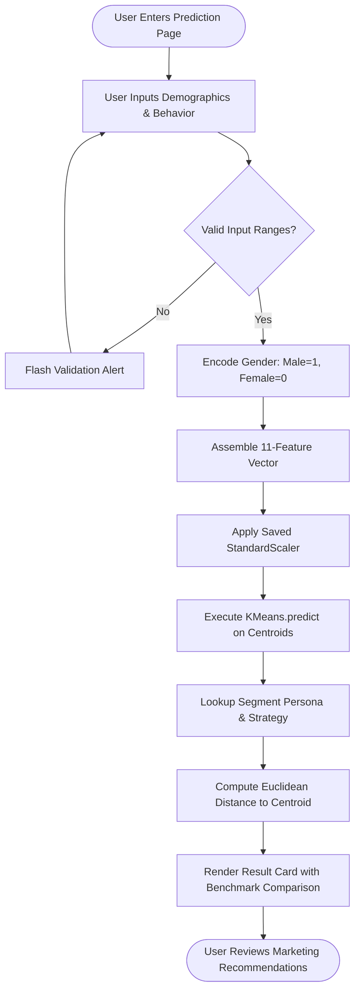
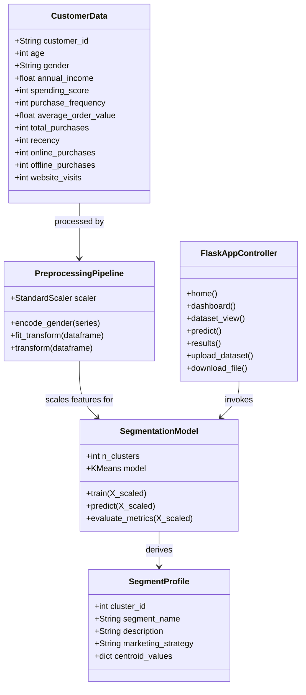
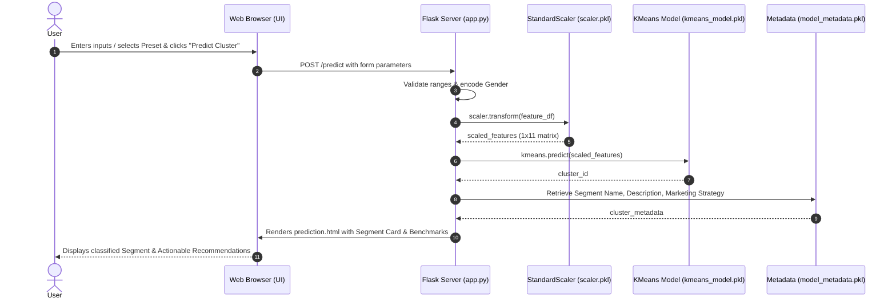
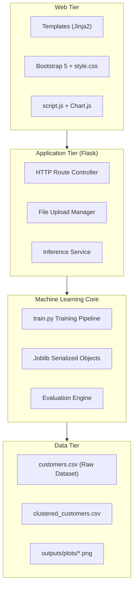
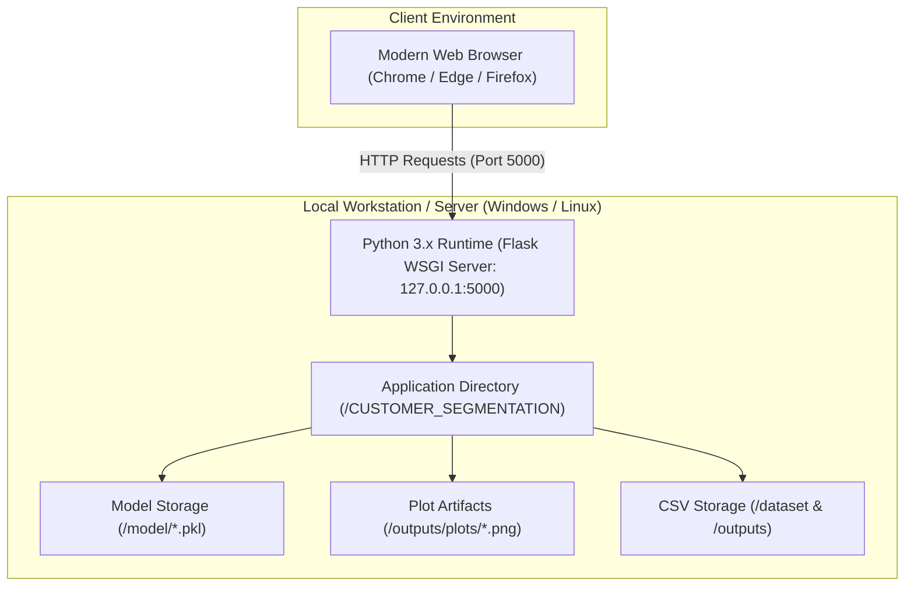
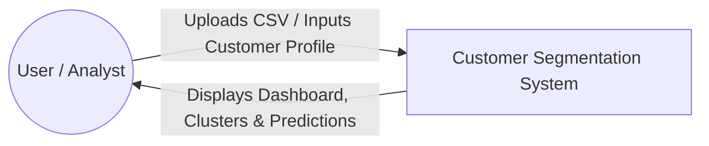
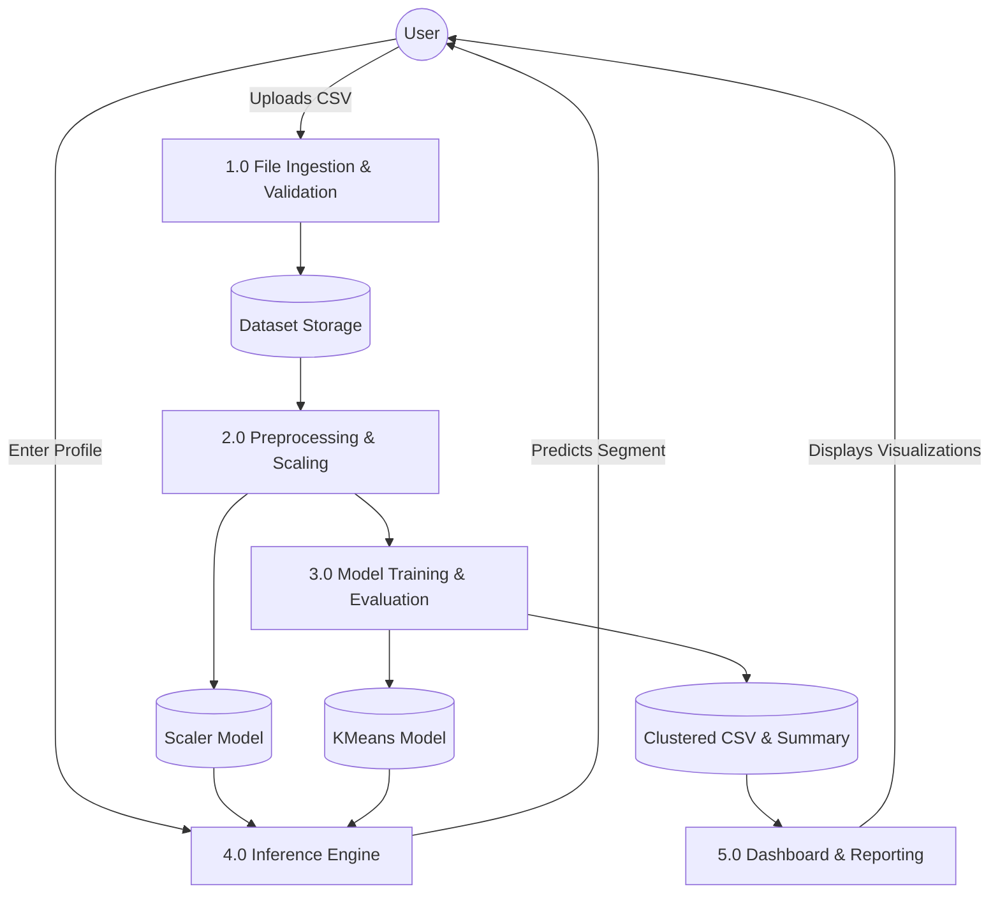

# Customer Segmentation Using Machine Learning-Based Clustering

**A Complete End-to-End B.Tech Computer Science & Engineering Academic Project**

---

## 1. Project Overview

In today's highly competitive commercial and digital commerce environment, businesses collect vast quantities of customer interaction and transactional data. However, treating all customers identically leads to suboptimal marketing spend, low conversion rates, and diminished customer retention. 

This project implements an end-to-end unsupervised machine learning system titled **“Customer Segmentation Using Machine Learning-Based Clustering”**. The system ingests multidimensional demographic and purchasing behavior data, executes a robust preprocessing and feature-scaling pipeline, determines optimal cluster numbers through empirical heuristics (**Elbow Method** and **Silhouette Analysis**), partitions customers using **K-Means Clustering**, and serves the resulting intelligence through an interactive, full-stack **Flask web application**.

---

## 2. Problem Statement

Modern retail and e-commerce enterprises face severe challenges in understanding customer diversity:
1. **One-Size-Fits-All Inefficiency:** Generic marketing campaigns fail to resonate with distinct customer tiers, wasting marketing capital on low-conversion segments.
2. **Customer Churn Risk:** Inability to identify at-risk or dormant customers before they permanently abandon the platform.
3. **Suboptimal Revenue Realization:** High-income, high-spending customers often receive standard promotions rather than high-value VIP concierge incentives that maximize customer lifetime value (CLV).
4. **Behavioral Complexity:** Purchasing habits encompass multi-channel metrics (online visits, physical store visits, order frequency, order basket size, recency) that cannot be segmented manually or with simple static business rules.

---

## 3. Proposed Solution

The proposed system applies **Unsupervised Machine Learning (K-Means Clustering)** to partition customers into distinct behavioral segments without requiring manual labels. By computing multi-feature spatial distances in normalized vector space, the system automatically discovers natural cohorts such as *High-Value Champions*, *Budget-Conscious Shoppers*, *Young Impulse Trendsetters*, *Affluent Conservative Savers*, and *At-Risk Occasional Customers*.

The solution couples the algorithmic engine with a production-grade **Flask web application**, providing marketing managers with an interactive analytics dashboard, live single-customer segmentation inference, dataset exploration tools, and exportable business intelligence reports.

---

## 4. Key Objectives

1. **Automated Behavioral Clustering:** Build an unsupervised learning pipeline that segments customers across 11 demographic and transactional dimensions.
2. **Heuristic Cluster Optimization:** Implement and visualize the **Elbow Method (WCSS)** and **Silhouette Analysis** across $K = 2 \text{ to } 10$ to identify optimal clustering hyper-parameters.
3. **Statistical Validation:** Evaluate clustering quality using rigorous mathematical indices: **Silhouette Score**, **Davies-Bouldin Index**, and **Calinski-Harabasz Score**.
4. **Dynamic Persona Synthesis:** Compute statistical centroids for each cluster to automatically label customer personas and generate tailored business marketing strategies.
5. **Interactive Full-Stack Web Application:** Deliver an intuitive Flask dashboard supporting dataset uploads, exploratory data visualizations, live customer inference, and dataset exports.

---

## 5. Technology Stack

| Layer | Technologies Used |
| :--- | :--- |
| **Programming Language** | Python 3.x |
| **Data Processing & Math** | Pandas, NumPy |
| **Machine Learning Engine** | Scikit-learn (KMeans, StandardScaler, PCA, Metrics) |
| **Data Visualization** | Matplotlib, Seaborn, Chart.js |
| **Model Serialization** | Joblib |
| **Web Backend** | Flask (Python WSGI Framework), Werkzeug |
| **Frontend UI** | HTML5, CSS3, JavaScript (ES6+), Bootstrap 5.3, Bootstrap Icons |
| **Dataset Format** | CSV (Comma-Separated Values) |

---

## 6. Dataset Description

The system uses a realistic customer dataset containing 1,000 records structured across 12 primary features:

| Field Name | Type | Description | Range / Example |
| :--- | :--- | :--- | :--- |
| `Customer_ID` | String | Unique customer identifier | `C0001` - `C1000` |
| `Age` | Integer | Age of customer in years | $18 - 72$ years |
| `Gender` | String | Customer gender category | `Female`, `Male` |
| `Annual_Income` | Float/Int | Total annual earnings | ₹2,50,000 - ₹30,00,000 |
| `Spending_Score` | Integer | Normalized purchasing score assigned by merchant | $1 - 100$ |
| `Purchase_Frequency` | Integer | Average number of completed orders per month | $1 - 48$ orders |
| `Average_Order_Value`| Float | Average monetary basket size per transaction | ₹500 - ₹15,000 |
| `Total_Purchases` | Integer | Total lifetime transactions recorded | $4 - 180$ purchases |
| `Recency` | Integer | Number of days elapsed since the last purchase | $1 - 365$ days |
| `Online_Purchases` | Integer | Count of purchases completed via website/mobile app | $0 - 120$ |
| `Offline_Purchases` | Integer | Count of purchases completed in physical retail stores | $0 - 100$ |
| `Website_Visits` | Integer | Frequency of monthly website or mobile app sessions | $1 - 60$ visits |

---

## 7. Machine Learning Methodology



### Detailed Pipeline Stages:
1. **Data Ingestion & Cleaning:** Reads CSV, verifies nulls, imputes missing records via feature medians/modes, and eliminates duplicates.
2. **Feature Engineering & Encoding:** Encodes binary gender (`Female: 0`, `Male: 1`) and isolates the 11 feature dimensions.
3. **Feature Scaling (StandardScaler):** Centers each feature around mean $\mu = 0$ with unit variance $\sigma = 1$:
   $$z = \frac{x - \mu}{\sigma}$$
   This step prevents high-magnitude features like `Annual_Income` from skewing Euclidean distance computations.
4. **Heuristic Cluster Search ($K=2 \dots 10$):**
   - **Elbow Method:** Measures Within-Cluster Sum of Squares (Inertia):
     $$WCSS = \sum_{i=1}^{K} \sum_{x \in C_i} ||x - \mu_i||^2$$
   - **Silhouette Score:** Evaluates mean intra-cluster distance ($a$) vs nearest-cluster distance ($b$):
     $$s = \frac{b - a}{\max(a, b)}$$
5. **K-Means Training:** Model converges on centroid locations via iterative expectation-maximization with `k-means++` initialization.
6. **Centroid Extraction & Dynamic Segment Labeling:** Computes the mean coordinates of each cluster and translates them into business personas.

---

## 8. Discovered Customer Segments

| Cluster | Segment Persona | Key Demographic & Purchasing Traits | Recommended Marketing Strategy |
| :---: | :--- | :--- | :--- |
| **0** | **High-Value Champions** | High Income (~₹20.5L), High Spending Score (85+), AOV > ₹8,500, Low Recency (< 10 days). | VIP loyalty programs, personalized concierge, early access to flagship products. |
| **1** | **At-Risk Occasional Customers** | Moderate Income (~₹9.5L), Moderate Spending (47), Very High Recency (170+ days dormant). | Automated win-back campaigns, reactivation discounts, re-engagement surveys. |
| **2** | **Young Impulse Trendsetters** | Young age (~23), Mid Income (~₹7.2L), High Spending (83+), High Web Visits (37+). | Social media influencer marketing, flash sales, gamified mobile drops. |
| **3** | **Affluent Conservative Savers**| High Income (~₹21.8L), Low Spending Score (~22), High Order Basket Size (₹7,200+). | High-ticket value packages, quality guarantees, premium product warranties. |
| **4** | **Budget-Conscious Shoppers** | Lower Income (~₹4.2L), Low Spending Score (~24), Low AOV (~₹1,200), price-sensitive. | Bulk bundle discounts, free shipping thresholds, clearance sale notifications. |

---

## 9. Evaluation Metrics

| Metric | Measured Value | Theoretical Range | Interpretation |
| :--- | :---: | :---: | :--- |
| **Silhouette Score** | **0.4852** | $[-1, +1]$ | Values $> 0.40$ indicate compact, distinct, and well-separated clusters. |
| **Davies-Bouldin Index** | **0.8859** | $[0, \infty)$ | Values $< 1.0$ indicate clusters with low intra-cluster scatter and good separation. |
| **Calinski-Harabasz Score**| **1065.72** | $[0, \infty)$ | High variance ratio proves cluster cohesion is significantly higher than background variance. |
| **WCSS / Inertia** | **2081.64** | $[0, \infty)$ | Demonstrates the knee inflection point on the Elbow curve at $K=5$. |

---

## 10. System Architecture & UML Diagrams

### 10.1 System Architecture Diagram


### 10.2 Use Case Diagram


### 10.3 Activity Diagram (Customer Prediction Workflow)


### 10.4 Class Diagram


### 10.5 Sequence Diagram (Prediction Cycle)


### 10.6 Component Diagram


### 10.7 Deployment Diagram


### 10.8 Data Flow Diagram (DFD Level 0 & Level 1)

#### Level 0 (Context Diagram)


#### Level 1 DFD


---

## 11. Project Directory Structure

```
CUSTOMER_SEGMENTATION/
│
├── dataset/
│   └── customers.csv                     # Raw customer dataset (1,000 records)
│
├── model/
│   ├── train.py                          # Complete ML training & evaluation script
│   ├── kmeans_model.pkl                  # Serialized Scikit-learn K-Means model
│   ├── scaler.pkl                        # Serialized StandardScaler object
│   └── model_metadata.pkl                # Metadata, features & dynamic segment definitions
│
├── templates/
│   ├── base.html                         # Unified responsive layout, navbar & alerts
│   ├── index.html                        # Project home landing page
│   ├── dashboard.html                    # Interactive KPI & analytics dashboard
│   ├── dataset.html                      # Dataset schema, summary stats & preview
│   ├── prediction.html                   # Single customer prediction form & presets
│   └── results.html                      # Clustered dataset table & download links
│
├── static/
│   ├── css/
│   │   └── style.css                     # Custom styles, dark-slate theme & cards
│   └── js/
│       └── script.js                     # Preset loader, Chart.js & table filter
│
├── outputs/
│   ├── clustered_customers.csv           # Clustered dataset with assigned Cluster_ID
│   ├── cluster_summary.csv               # Centroid means & strategic profiles
│   ├── metrics.json                      # Mathematical evaluation metrics (Silhouette, DB, CH)
│   └── plots/
│       ├── elbow_curve.png               # WCSS vs K (Elbow Method)
│       ├── silhouette_graph.png          # Silhouette score across K=2 to 10
│       ├── cluster_distribution.png      # Customer volume per segment
│       ├── income_vs_spending.png        # Scatter plot colored by cluster
│       ├── age_vs_spending.png           # Age vs Spending score plot
│       ├── frequency_vs_spending.png     # Frequency vs Spending score plot
│       ├── correlation_heatmap.png       # Correlation matrix of numerical features
│       ├── pca_2d_clusters.png           # 2D PCA cluster projection
│       └── cluster_boxplots.png          # Feature boxplots per cluster
│
├── app.py                                # Flask web application backend
├── customer_segmentation.ipynb           # Comprehensive end-to-end Jupyter Notebook
├── generate_dataset.py                   # Realistic dataset synthesis utility
├── requirements.txt                      # Project library dependencies
├── test_app.py                           # Automated unit test suite
└── README.md                             # Comprehensive project documentation
```

---

## 12. Installation & Setup Guide

### Step 1: Open Terminal / PowerShell
Navigate to the project root directory:
```bash
cd c:\Users\divyteja\OneDrive\Desktop\CUSTOMER_SEGMENTATION
```

### Step 2: Install Required Dependencies
```bash
pip install -r requirements.txt
```

### Step 3: Train the Machine Learning Model
Run the model training pipeline:
```bash
python model/train.py
```
*Optional: To specify a custom cluster count K (e.g., K=5):*
```bash
python model/train.py --k 5
```

### Step 4: Run the Automated Unit Tests (Optional Verification)
```bash
python test_app.py
```
*(Confirms that all Flask routes, model inference, and CSV downloads return HTTP 200 OK).*

### Step 5: Start the Flask Web Application
```bash
python app.py
```

### Step 6: Access the Web Application
Open your web browser and navigate to:
```
http://127.0.0.1:5000
```

---

## 13. Web Application User Guide

1. **Home Page (`/`)**: Displays project overview, key statistical cards, discovered customer persona previews, and ML architectural flow.
2. **Dashboard (`/dashboard`)**:
   - Primary metric counters (Total Customers, Clusters, Silhouette Score, Avg Income, Avg Spending).
   - Live interactive doughnut chart (Cluster distribution) and dual-axis line chart (WCSS Elbow & Silhouette scores).
   - Complete statistical centroids table mapping cluster averages to strategic marketing actions.
   - High-resolution gallery displaying 6 publication-grade Seaborn plots.
3. **Dataset & EDA (`/dataset`)**:
   - Inspect dataset schema, null value analysis, and complete descriptive statistics (mean, std, percentiles).
   - Searchable, scrollable preview of customer records.
   - CSV upload form supporting custom dataset uploads and automatic model retraining.
4. **Predict Segment (`/predict`)**:
   - Fill in demographic and transactional attributes for a single customer.
   - Use the **Quick Presets** buttons (*High-Value Champion*, *Budget Shopper*, *Young Trendsetter*, etc.) for one-click testing during demonstrations.
   - Click **Predict Cluster** to display the assigned cluster, segment name, marketing strategy, and benchmark comparison table.
5. **Results & Downloads (`/results`)**:
   - Filter clustered customer table by specific cluster IDs.
   - Search table dynamically by Customer ID or Segment Name.
   - Download the full labeled dataset (`clustered_customers.csv`) or the cluster summary (`cluster_summary.csv`).

---

## 14. Advantages & Practical Applications

1. **Precision Targeting:** Eliminates marketing waste by targeting customer cohorts with promotions tailored to their spending capacity and channel preference.
2. **Proactive Retention:** Automatically detects *At-Risk Occasional Customers* who exhibit long recency periods, enabling automated win-back workflows.
3. **Optimized Resource Allocation:** Directs premium concierge services and loyalty rewards specifically toward *High-Value Champions*.
4. **Transparent & Interpretable:** Unlike black-box deep learning models, K-Means clustering with dynamic centroid profiling provides clear, explainable business reasoning.
5. **Production-Ready Web Portal:** Combines machine learning algorithms with a user-friendly UI suitable for non-technical retail decision-makers.

---

## 15. Realistic Limitations

1. **Spherical Cluster Assumption:** K-Means calculates spherical Euclidean boundaries, which may become suboptimal for non-linear, arbitrary-shaped cluster distributions.
2. **Fixed Cluster Count:** The algorithm requires an explicit specification of $K$, necessitating heuristic evaluation methods (Elbow / Silhouette).
3. **Sensitivity to Feature Scaling:** Unscaled attributes severely distort distance calculations, making rigorous standardization mandatory.
4. **Static Snapshot Data:** The current pipeline performs batch clustering rather than continuous streaming data clustering.

---

## 16. Future Scope & Enhancements

1. **Streaming / Real-Time Data Ingestion:** Connect to Apache Kafka or AWS Kinesis for live transaction clustering.
2. **Hybrid & Density-Based Clustering:** Integrate DBSCAN and Hierarchical Clustering for arbitrary-shaped density discovery.
3. **Product Recommendation Integration:** Incorporate Collaborative Filtering (Matrix Factorization) to recommend specific products based on cluster membership.
4. **Customer Lifetime Value (CLV) Prediction:** Combine clustering with supervised regression (XGBoost/LightGBM) to forecast future revenue potential per customer.
5. **Automated Marketing API Integrations:** Integrate with email marketing services (e.g., SendGrid, Mailchimp) to automatically trigger targeted campaigns upon segment classification.

---

## 17. B.Tech CSE Viva Preparation & Defense Guide

### Top Viva Questions & Answers:

**Q1: Why did you choose K-Means over supervised classification algorithms?**
> *Answer:* Customer data in real-world retail does not come with pre-assigned ground truth labels. K-Means is an unsupervised clustering algorithm that discovers hidden patterns and natural customer groupings without requiring labeled training targets.

**Q2: Why is `StandardScaler` mandatory before applying K-Means?**
> *Answer:* K-Means computes Euclidean distances between vectors: $d(p, q) = \sqrt{\sum (p_i - q_i)^2}$. If features have vastly different numeric magnitudes (such as `Annual_Income` in lakhs of rupees e.g. ₹20,00,000 versus `Age` between 18 and 70), the high-magnitude feature will completely dominate distance calculations. `StandardScaler` standardizes each feature to mean 0 and unit variance, ensuring equal feature weighting.

**Q3: How did you determine the optimal number of clusters?**
> *Answer:* We utilized two complementary mathematical methods:
> 1. **The Elbow Method**, which calculates the Within-Cluster Sum of Squares (WCSS/Inertia) across $K=2 \dots 10$ and identifies the inflection point (elbow).
> 2. **Silhouette Analysis**, which measures cluster cohesion versus separation. $K=5$ yielded the highest multi-cluster Silhouette Score (0.4852) and the lowest Davies-Bouldin index (0.8859).

**Q4: What is the significance of the Silhouette Score?**
> *Answer:* The Silhouette Score evaluates how close each point is to points in its assigned cluster compared to points in neighboring clusters. It ranges from $-1$ to $+1$. A score near $+1$ indicates well-separated, distinct clusters, near $0$ indicates overlapping clusters, and negative values indicate misclassification. Our score of ~0.4852 confirms strong cluster quality.

**Q5: How does your web application predict the cluster for a new customer?**
> *Answer:* When a user enters customer attributes in the web form, the backend takes the 11-feature vector, applies the fitted `StandardScaler` (`scaler.pkl`), and calls `kmeans.predict(scaled_vector)`. K-Means calculates the Euclidean distance between the scaled customer vector and all 5 cluster centroids, assigning the customer to the closest centroid.

**Q6: What is the purpose of PCA in your project?**
> *Answer:* Our dataset has 11 feature dimensions, which cannot be visualized in 2D or 3D space directly. We applied Principal Component Analysis (PCA) to reduce the dimensionality to the 2 principal components capturing maximum variance (~50-60%), enabling clear 2D scatter plots of cluster separation.
